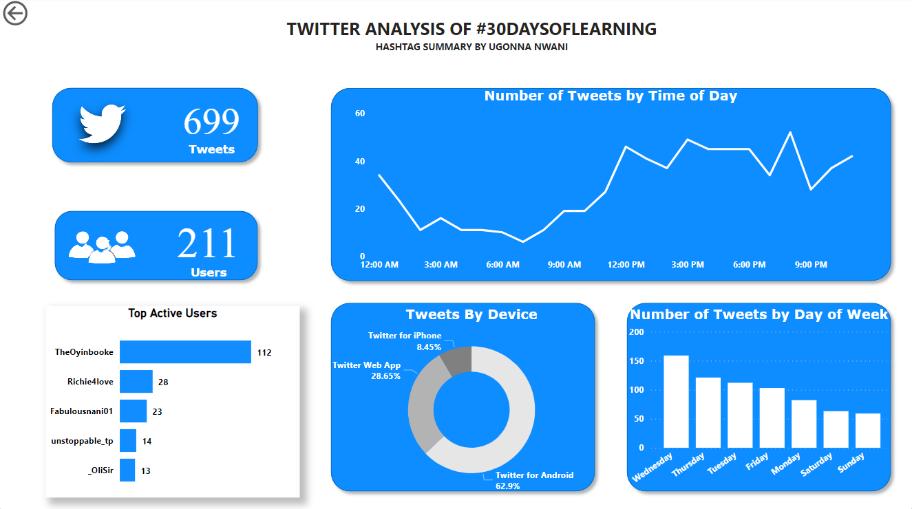

# NG-30-Days-of-Learning
This is a documentation of my 30 days of learning journey organized by Microsoft. Check [here](https://aka.ms/30DLDATLandingPage) for more details.

## Day 1:
We were introduced to Microsoft Excel's Analyse Data function that help you to analyse data and suggests charts and Pivot tables that might be useful in your analysis. We used a sample Financial dataset to produce samplt charts and pivot tables.

## Day 2
We were taught how to scrape Covid19 data from [this github page](https://github.com/CSSEGISandData/COVID-19/tree/master/csse_covid_19_data/csse_covid_19_time_series). Using Power Query, we were able to transform the data from wide to long format, rename columns and merge datasets to create a master dataset. This dataset is directly connected to the github page and updates the master dataset automatically.

## Day 4
We were shown how to make No-Code Dashboards. We integrated Microsoft Power BI to; 
* Microsoft Teams to analyze Team activity 
* Sharepoint, where we uploaded the Financial Sample Data from Day 1 to a site and generated a dashboard without doing anything.
* Powerpoint, where we can upload dashboard links to powerpoint slides and have dashboards that change in real-time for presentations.

## Day 3
We created a Dashboard with Microsoft Excel using the Covid 19 data that we scraped in Day 2. We created pivot tables and different types of charts, we used slicers to make filters and we added images to the dashboard.

## Day 5
Today, we had a meeting with industry experts on what it meant to work as a data analyst in corporate settings. The meeting was tagged "A Day in the life of a Data Analyst". We got to hear first hand stories of how our guests were able to break into the data space. Career advice was given to we who wanted to start our journey, and they answered the questions we had about their journey.

## Day 6/7
Weekend! We did a recap of the activities and were encouraged to register for the Cloud skill challenge where were to complete a number of modules under the Data Analysis with Power BI track.

## Day 8
We learnt about importing data into Microsoft Power BI. We were shown how to import data from six different sources including Sharepoint, The web and SQL server database. After we were tasked with creating a practice dashboard using what we have been learning in the [Cloud skill challenge](https://aka.ms/30DLDataAnalysis).

## Day 9
Today, we were introduced to [Power Query](https://aka.ms/30DLDATPQEditor) and we also took lessons on Cleaning, Transforming and Loading data in Power BI. This lesson was part of the modules to be taken in the Cloud Skill Challenge.

After, we were told to get data from a [site](https://www.bankrate.com/retirement/best-and-worst-states-for-retirement/) that had a table of the best US states to retire in and build a dashboard in Power BI.

## Day 10
Today, we had a live session where we talked about Data Modelling, Relationships, Managing Relationships and Cardinality. The speaker, Ahmed Oyelowo demonstrated the use of Data Modelling by demonstrating how relationships between different tables are formed and how they are necessary if we are to be able to create visualizations using variables from different tables in Microsoft Power BI. He used this [dataset](https://aka.ms/30DLDATGitHubRepo) to demonstrate the concepts taught.

After, we were asked to create a report using the newly modelled dataset.

## Day 11
Continuing for yesterday's session, we were introduced to Data Analysis Expressions (DAX) today, we saw how to create new variables (calculated columns) from already existing variables using DAX, how to create tables, how to filter tables, how to create measures, we even combined some of these concepts to create measures from filtered tables (used in the case when you want to exclude a particular value in your chart).

We saw this applied on the Superstore dataset of the previous day, were we filtered out "Organic" from the Sales Team column then we calculated the Total Sales. This excluded "Organic" from a bar chart showing Sales by Sales Team. 

## Day 13/14
Weekend! We were motivated to completing the Cloud skills Challenge by Mr Oyinbooke, a Senior Cloud Advocate at Microsoft. We were also treated to interviews of fellow learners in the 30 days of learning journey, their stories and how much of an impact acquiring this skill would make in their career.

## Day 15
Today, We had a live session on the topic *Data Storytelling with PowerBI*. Our host was Paul Nnakwe, a Digital Media Specialist and Data Analyst. He spoke about storytelling and how to tell good stories with our data. He talked about use of colors, font, and other features in a visualization and how they are important in passing information accurately to your audience.

After, we scraped tweet data. We scraped tweets from Twitter that used the hashtag #30DaysOfLearning and #NG30DaysOfLearning using Python and the snscrape library. We then loaded the data into Power BI, transformed the data and built an example dashboard, following our host's lead.

## Day 16
Today's session was a continuation of yesterday's session. We finished building the report on PowerBI. We made an Overview page, Summary page and a Content Analysis page where we analysed the tweets, looking for most popular words, commonly mentioned tools and more. 

## Day 17
Today, we looked at how to create Dashboards in PowerBI service. We were guided on how to publish out reports from PowerBI Desktop to PowerBI service. We used Car data from [Kaggle](https://aka.ms/30DLDATGitHubRepo) to demonstrate creating and managing interactive dashboards.

This session was led by Mr. Oyinbooke.

## Day 18
We learnt how to schedule refresh in PowerBI Desktop. We learnt about the four PowerBI dataset storage modes; 
* Import mode
* DirectQuery mode
* LiveConnect mode
* Push mode. 

Data refresh is only for Import mode because the rest of the storage modes pull data from the source everytime a .pbix file is opened but the Import mode takes a snapshot of the data only once, when the data is imported into PowerBI. So it needs to be refreshed if any changes to the data is to be reflected.

## Day 19 
We learnt how to control access and govern reports and dashboards. We were taught about row-level security, Basic row-level security and Dynamic row-level security.

## Day 20/21
Weekend! Finshed the Microsoft Cloud skill Challenge:hugs:

## Day 22 - Day 26
We were given a [capstone project](https://aka.ms/30DLDATCapstoneProject) so that we would demonstrate all that we have learnt and put our knowledge to use. The project consists of two case studies and we were to do at least one and document on GitHub. 
